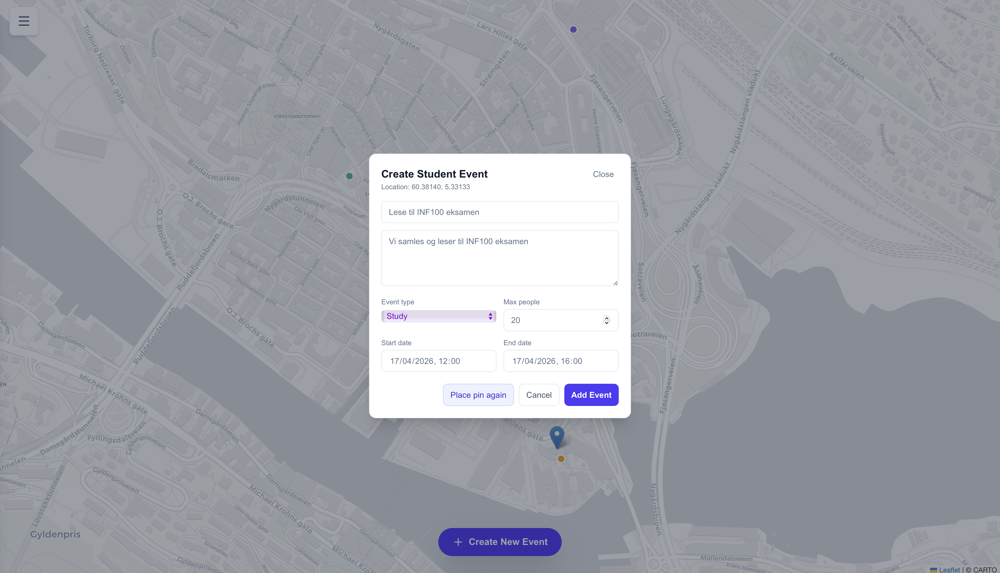
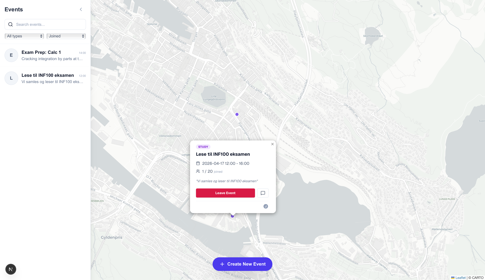
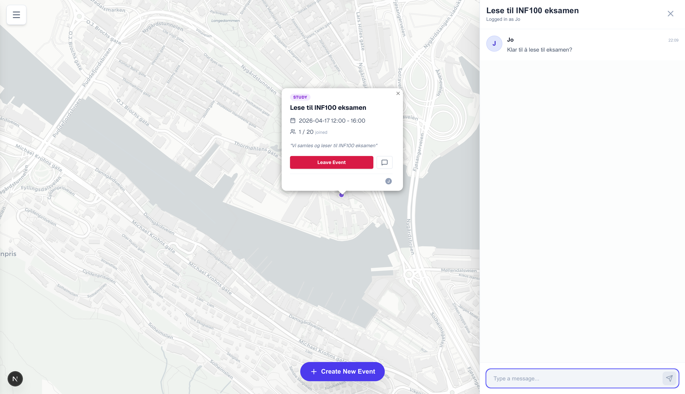

# Webathon 2026

# StudentWhere

Team: Hustlers

## Medlemmer

- Karl-Gustav
- Jo

## Beskrivelse

StudentWhere er et sosialt studentkart der studenter kan opprette og finne åpne events i sanntid.

Konseptet bygger videre på ideen om et «Snap Map»-lignende kart, men med fokus på studentmiljø:

- Sett en pin på kartet for å opprette et event.
- Bruk events til åpne studiegrupper, sosiale samlinger, møter, frivillighet eller spontane aktiviteter.
- Se hvem som har blitt med, og bli med/forlat events direkte fra kartet.
- Filtrer og søk i events for å finne det som er relevant akkurat nå.

Målet er å gjøre det enklere å oppdage hva som skjer rundt deg på campus, og senke terskelen for å bli med på aktiviteter.

### Hovedfunksjoner

- Interaktivt kart med event-markører
- Oppretting av nye events via popup
- Join/leave av events med lokal status + database-oppdatering
- Chat per event
- Sidebar med søk og filtrering (eventtype og joined/not joined)
- Synkronisert filtrering mellom sidebar og kart

## Teknologi

- Next.js + React + TypeScript
- Supabase (lagring av events, registreringer og chat)
- Leaflet / React-Leaflet (kart)
- Tailwind CSS (UI)

## Kjøre

Prosjektet er live på:

https://webathon-tau.vercel.app

### Kjøre lokalt:

```bash
pnpm install
pnpm dev
```

Åpne deretter `http://localhost:3000` i nettleseren.

### Miljøvariabler

Prosjektet bruker Supabase. Du trenger følgende miljøvariabler i en `.env.local`:

```bash
NEXT_PUBLIC_SUPABASE_URL=...
NEXT_PUBLIC_SUPABASE_ANON_KEY=...
```

## Bilder








